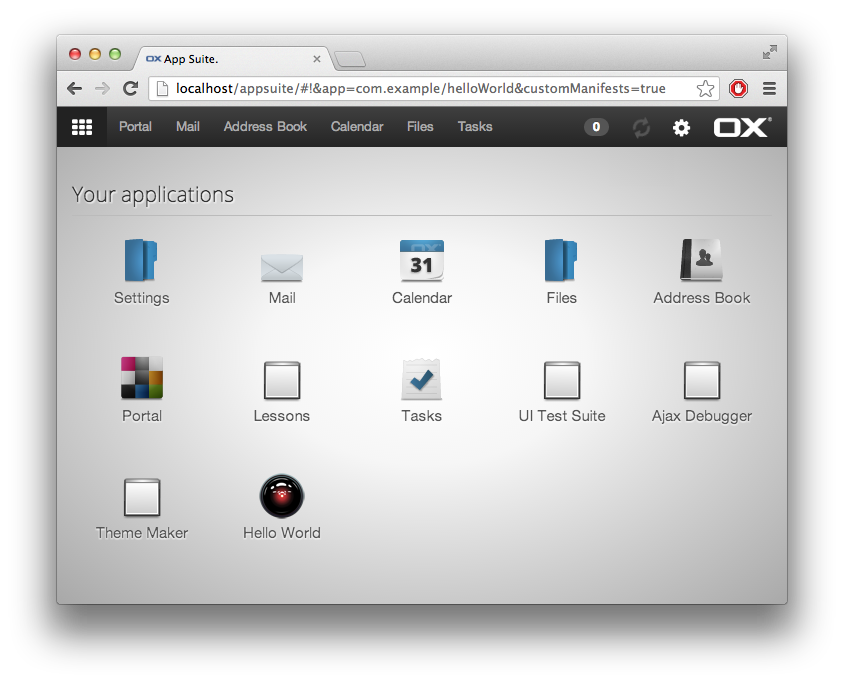
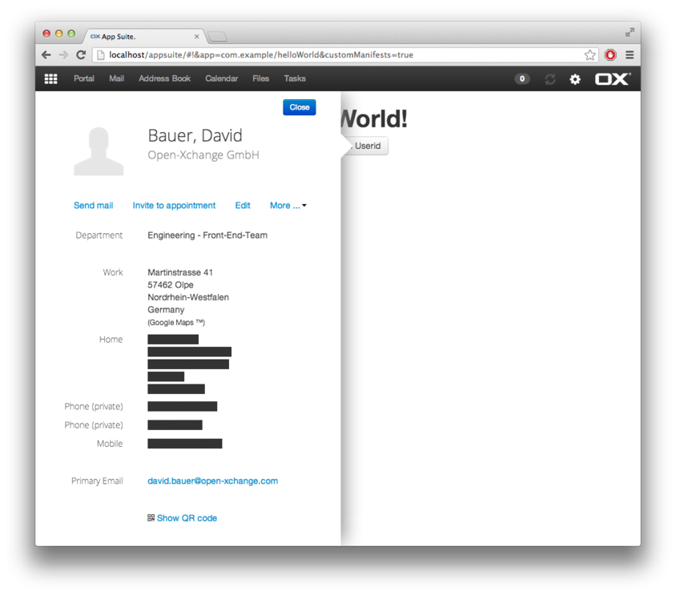

# Getting Started

First create a new folder helloWorld in your namespace in the app folder, in this example the namespace com.example will be used. (``apps/com.example/helloWorld`)

For starters we need two files: a manifest File ``manifest.json`` and the application file.
It is convention to name your main application file ``main.js``.

# Manifest

First create a ``manifest.json`` file, describing the basic properties of your app.

```
{
    title: "Hello World",
    company: "Open-Xchange",
    icon: "/images/icon.png",
    category: "Dev",
    settings: false,
    requires: "dev",
    index: 100
}
```

Whilst developing, the manifest has to be added to src/manifests.json. Note: _Same as above except for the path, which is mandatory_.

```
...
{
    path: 'com.example/helloWorld/main',
    title: "Hello World",
    company: "Open-Xchange",
    icon: "/images/icon.png",
    category: "Dev",
    settings: false,
    requires: "dev",
    index: 100
},
...
```

You can find more detailed information on manifests here: [UI manifests explained](http://oxpedia.org/wiki/index.php?title=AppSuite:UI_manifests_explained).

## Setting an app icon

It is convention to place your app image into a subfolder of your app called images. The icon defined here will be displayed in the "Your applications" area.



# Simple application

This is the base skeleton of a new app with a window, that displays "Hello World".
Please read the annotated source code of an example main.js below, it is quite self-explanatory.

```javascript
define('com.example/helloWorld/main', [], function () {

    'use strict';

    // this is just code. loading this does not imply to launch the application

    // application object. 'name' is mandatory!
    var app = ox.ui.createApp({ name: 'com.example/helloWorld' });

    // by using setLauncher this way, we register a callback function
    // that is called when the application is really launched
    app.setLauncher(function () {

        // application window (some applications don't have a window)
        var win = ox.ui.createWindow({
            name: 'com.example/helloWorld',
            title: 'Hello World'
        });

        app.setWindow(win);

        // Add css class with your namespace
        win.addClass('com-example-helloWorld');

        // add something on 'main' node
        win.nodes.main
            .css({ padding: '13px', textAlign: 'center' })
            .append($('<h1>').text('Hello World!'));

        // show the window
        win.show();
    });

    return {
        getApp: app.getInstance
    };
});
```

Save this file, build and refresh your browser, go to "Your applications", where you should find your app with your app icon.
Hint: You can also launch the application manually via your browsers console:

```javascript
ox.launch('com.example/helloWorld/main');
```


## Styles

In order to prevent conflicts with other apps or base-styles you should add a css class with your namespace to the main node of your application.

```javascript
win.addClass('com-example-helloWorld');
```

It is convention to create a file called style.less in the root folder of your application. This file has to be defined for [require.js](http://requirejs.org/docs/api.html) which is done like this.

```javascript
...
define('com.example/helloWorld/main',
    ['less!com.example/helloWorld/style.less'
    ], function () {
...
```

A simple less file would look like this:

```javascript
.com-example-helloWorld {
    h1 {
        color: red;
    }
    ...
}
```


## Internationalization (i18n)

In order to get gettext support for your app you have to require it:

```javascript
...
define('com.example/helloWorld/main',
    [...
    'gettext!com.example/helloWorld'
    ...
    ], function (gt) {
...
```

Every string in your app should be processed by gettext in order to have them properly translated.
In our example it would look like this:

```javascript
...
    .append($('<h1>').text(gt('Hello World!')));
...
```

Hint: If you want to check your app for untranslated strings, append &debug-i18n=true to the URL in your browser and refresh. If a string is not processed by gettext it will be highlighted.

You can find more detailed information on this topic here: [Appsuite:i18n](http://oxpedia.org/wiki/index.php?title=AppSuite:I18n).

## Making an application window chromeless

If you don't have the need for a toolbar and want a chromeless window, you can it in the ox.ui.createWindow function call.


```javascript
...
var win = ox.ui.createWindow({
    ...
    chromeless: true
    ...
});
...
```

## Creating a Dialog

In order to open a dialog __io.ox/core/tk/dialogs__ has to be required and use one of the supplied methods.


```javascript
...
win.nodes.main
    .append($('<a class="btn">').text('Open Modal Dialog')
        .on('click', function (e) {
            e.preventDefault();
            require(['io.ox/core/tk/dialogs'],
                function (dialogs) {
                    new dialogs.ModalDialog({
                            width: 600,
                            easyOut: true
                        })
                        .append($('<p>').text('Hello world'))
                        .addButton('close', 'Close')
                        .show();
                }
            );
        })
    );
...
```


# Displaying a notification

If you want to display notifications you can require _io.ox/core/notifications_and use the yell method, like in the examples below.


```javascript
...
require(['io.ox/core/notifications'],
    function (notifications) {
        win.nodes.main
            .append(
                $('<a class="btn">').text('Display success notfication')
                    .on('click', function () {
                        notifications.yell('success', 'Ah success!');
                    }),
                $('<a class="btn">').text('Display error notfication')
                    .on('click', function () {
                        notifications.yell('error', 'Oh failed!');
                    })
            );
});
...
```


You can find information about more advanced notifications [here](http://oxpedia.org/wiki/index.php?title=AppSuite:Writing_a_notification_area_plugin).

# Displaying a Halo View

__For internal users__

```javascript
...
win.nodes.main.append(
    $('<a href="#" class="btn halo-link">')
    .data({ internal_userid: ox.user_id })
    .text('Open Halo')
);
...
```

__For external users__

```javascript
...
win.nodes.main.append(
    $('<a class="btn halo-link">')
    .data({ email1: 'test@example.com' })
    .text('Open Halo from Email')
);
...
```




# Using settings

To get or set settings you have to create a settings subfolder, with a _defaults.js_ in which the default values are defined for your settings and a _model.js_.
Below you will find a simple example of these files.

## Defaults

```javascript
define('com.example/helloWorld/settings/defaults', [], function () {

    'use strict';

    // define the default values for your settings here
    var settingsDefaults = {
        exampleSetting: false
    };

    return settingsDefaults;
});
```

## Model


```javascript
define('com.example/helloWorld/settings/model',
      ['settings!com.example/helloWorld'], function (settings) {

    'use strict';

    // Very simple default model
    var helloWorldModel = Backbone.Model.extend({


        initialize: function () {

        },

        save: function () {
            settings.save(this.attributes);
        },

        destroy: function () {

        }

    });

    return helloWorldModel;
});
```

## Get/Set


```javascript
...
require(['settings!com.example/helloWorld'],
    function (settings) {
        win.nodes.main
            .append(
                $('<label>').text(gt('Example Setting')),
                $('<input type="checkbox">')
                    .prop('checked', settings.get('exampleSetting', false))
                    .on('change', function () {
                        settings.set('exampleSetting', $(this).prop('checked')).save();
                    })
            );
    });
...
```

# Download full example

You can download the example application here with all above shown examples above included.

[Hello World - Simple application full example.zip](Hello_World_-_Simple_application_full_example.zip)

# Stuck somewhere?

You got stuck with a problem while developing? OXpedia might help you out with the article about [debugging the UI](http://oxpedia.org/wiki/index.php?title=AppSuite:Debugging_the_UI).
