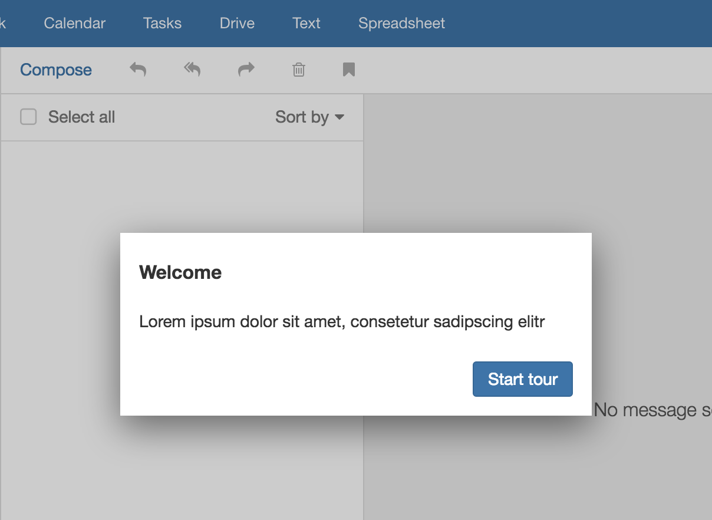

App Suite UI provides a simple but flexible framework to implement wizards and guided tours. The essence of  both a wizard and a tour is a set of steps the end-user walks through. Usually a step is a smaller modal popup.

# Simple example

The starting point is the "Wizard" (or "Tour") class defined in 'io.ox/core/tk/wizard.js'. A simple example:

```javascript
require(['io.ox/core/tk/wizard'], function (Tour) {
   new Tour()
   .step()
       .title('Welcome')
       .content('Lorem ipsum dolor sit amet, consetetur sadipscing elitr')
       .end()
   .start();
});
```

The function ```step()``` adds a new step. Each step is separate ```Backbone view``` instance (DisposableView to be more precise). The following function calls ```title()``` and ```content()``` both work on that view; ```end()``` just returns to the tour (same idea as in jQuery's end()). This allows long definition chains. A more complex example that puts a spotlight on an element:

```javascript
require(['io.ox/core/tk/wizard'], function (Tour) {
   new Tour()
   .step()
       .title('Welcome')
       .content('Lorem ipsum dolor sit amet, consetetur sadipscing elitr')
       .mandatory()
       .end()
   .step()
       .title('Step 2')
       .content('Lorem ipsum dolor sit amet, consetetur sadipscing elitr')
       .spotlight('#io-ox-topbar')
       .referTo('.launchers-secondary')
       .mandatory()
       .beforeShow(function () {
           // do anything you want to customize the step
           console.log('before show', this);
       })
       .end()
   .start();
});
```

# Screenshot

**Basic popup**



**Step with hotspot**


# API

| Function                                     | Description                                                                                                                                                                                                                                                         |
|----------------------------------------------|---------------------------------------------------------------------------------------------------------------------------------------------------------------------------------------------------------------------------------------------------------------------|
| Wizard/Tour                                  |
| step()                                       | Add a new wizard/tour step.                                                                                                                                                                                                                                         |
| start()                                      | Start the wizard/tour.                                                                                                                                                                                                                                              |
| Step                                         |
| title()                                      | Append content to the popup title. Handed over to jQuery's append; can be String, DOM element, jQuery set, a function.                                                                                                                                              |
| content()                                    | Append content the popup body. Handed over to jQuery's append; can be String, DOM element, jQuery set, a function.                                                                                                                                                  |
| footer()                                     | Append content to the popup footer. Handed over to jQuery's append; can be String, DOM element, jQuery set, a function.                                                                                                                                             |
| mandatory()                                  | Makes a step mandatory. The “close” icon gets removed; escape key no longer works.                                                                                                                                                                                  |
| toggleNext(state)                            | Enables (true) or disables (false) the “Next” button. All buttons are enabled by default. The first step doesn't have a back button, of course. And the last step offers a “Done” button instead of the “Next” button.                                              |
| toggleBack(state)                            | Enables (true) or disables (false) the “Back” button.                                                                                                                                                                                                               |
| isFirst()                                    | Returns true if the current step is the first one.                                                                                                                                                                                                                  |
| isLast()                                     | Returns true if the current step is the last one.                                                                                                                                                                                                                   |
| referTo(selector)                            | Affects the dialog location (alignment happens automatically).                                                                                                                                                                                                      |
| spotlight(selector)                          | Sets a spotlight on a given element.                                                                                                                                                                                                                                |
| hotspot(selector, options) or hotspot(array) | Places a hotspot on top left corner of given element; options can define “top” and “left” to adjust the position (pixel values). The API also support multiple hotspots: hotspot(array) with array containing selectors (string) or array of \[selector, options\]. |
| modal(\[state\])                             | Shows a darker backdrop. Default is true.                                                                                                                                                                                                                           |
| waitFor(selector, \[timeout\])               | The step waits for a certain element to exist before showing the popup. Optional: Use a custom timeout. Default is 5 seconds.                                                                                                                                       |
| navigateTo(id, \[options\])                  | The step launches given app (id) before showing the popup. “options” are optional; handed over to ox.launch().                                                                                                                                                      |
| scrollIntoView(selector)                     | This element will be scrolled into view before the popup is shown.                                                                                                                                                                                                  |
| beforeShow(callback)                         | Registers for the “before:show” event using once(). The callback's context is the step, i.e. “this” is a backbone view.                                                                                                                                             |
| end()                                        | Go back to parent element, i.e. the Wizard or the Tour.                                                                                                                                                                                                             |

# Events

| Event name      | Description                                                                                                 |
|-----------------|-------------------------------------------------------------------------------------------------------------|
| Wizard/Tour     |
| before:start    | Triggered before starting the wizard or the tour.                                                           |
| start           | Triggered when the wizard or the tour has been started                                                      |
| before:stop     | Triggered before closing the wizard or the tour.                                                            |
| stop            | Triggered when the wizard or the tour has been closed                                                       |
| step:\*         | All step-based events are forwarded, e.g. step:back, step:next, step:before:show                            |
| Step            |
| next / back     | Same as step:next or step:back (see above)                                                                  |
| close / done    | Same as step:close or step:done (see above)                                                                 |
| before:show     | Triggered before showing the step                                                                           |
| show            | Triggered when the step is visible                                                                          |
| before:hide     | Triggered before hiding the step                                                                            |
| hide            | Triggered when the step is hidden                                                                           |
| before:navigate | Triggered before the step navigates to another app                                                          |
| navigate        | Triggered after the step has navigated to another app                                                       |
| wait            | Triggered when the step wait for a certain element (waitFor)                                                |
| ready           | Triggered when “waitFor” is resolved (this event is always triggered, when a step is ready to be displayed) |
| align           | Triggered right after the automatic alignment but shortly before the step is shown                          |
||

# Using the registry

A tour only works once, i.e. its steps get disposed once the tour stops. This is intended behavior in order to avoid side-effects and memory leaks. If you want to run a tour twice you have to redefine it. The registry simplifies that:

```javascript
require(['io.ox/core/tk/wizard'], function (Tour) {

    // you can store any data you want; only 'id' is mandatory
    Tour.registry.add({ id: 'test', title: 'Test', type: 'tour' }, function () {

        new Tour()
        .step()
            .title('Welcome')
            .content('Lorem ipsum dolor sit amet, consetetur sadipscing elitr.')
            .spotlight('.classic-toolbar')
            .end()
        .start();
    });

    // run a tour
    Tour.registry.run('test');
});
```

The registry also helps at listing existing tours:

```javascript
require(['io.ox/core/tk/wizard'], function (Tour) {
    // get all items
    console.log(Tour.registry.list());
    // just get type=tour
    console.log(Tour.registry.list('tour'));
    // which is a shortcut for
    console.log(Tour.registry.collection.where({ type: 'tour' }));
});
```

# Complex example

```javascript
void require(['io.ox/core/tk/wizard'], function (Tour) {

    Tour.registry.add({ id: 'test', title: 'Test', type: 'tour' }, function () {

        new Tour()
        .step()
            .title('Welcome')
            .content('Lorem ipsum dolor sit amet, consetetur sadipscing elitr, sed diam nonumy eirmod tempor invidunt ut labore et dolore magna aliquyam erat, sed diam voluptua.')
            .spotlight('.classic-toolbar')
            .end()
        .step()
            .title('Top-bar')
            .content('Lorem ipsum dolor sit amet, consetetur sadipscing elitr, sed diam nonumy eirmod tempor invidunt ut labore et dolore magna aliquyam erat, sed diam voluptua.')
            .spotlight('#io-ox-topbar')
            .referTo('.launchers-secondary')
            .end()
        .step()
            .title('Search')
            .content('Lorem ipsum dolor sit amet, consetetur sadipscing elitr, sed diam nonumy eirmod tempor invidunt ut labore et dolore magna aliquyam erat, sed diam voluptua.')
            .spotlight('.io-ox-find')
            .end()
        .step()
            .title('Something at the bottom')
            .content('Lorem ipsum dolor sit amet, consetetur sadipscing elitr, sed diam nonumy eirmod tempor invidunt ut labore et dolore magna aliquyam erat, sed diam voluptua.')
            .spotlight('.generic-toolbar.bottom')
            .end()
        .step()
            .title('Top toolbar')
            .content('Lorem ipsum dolor sit amet, consetetur sadipscing elitr, sed diam nonumy eirmod tempor invidunt ut labore et dolore magna aliquyam erat, sed diam voluptua.')
            .spotlight('.toolbar.generic-toolbar.top')
            .end()
        .step()
            .title('Step 2')
            .navigateTo('io.ox/mail/main')
            .waitFor('.thread-view-list')
            .mandatory()
            .content('Lorem ipsum dolor sit amet, consetetur sadipscing elitr, sed diam nonumy eirmod tempor invidunt.')
            .spotlight('.thread-view-list')
            .end()
        .step()
            .title('Step 3')
            .content('Lorem ipsum dolor sit amet.')
            .navigateTo('io.ox/contacts/main')
            .waitFor('.folder[data-id="6"]')
            .spotlight('.folder-tree')
            .scrollIntoView('.folder[data-id="6"]')
            .beforeShow(function () {

                this.$('.content').append(
                    $('<p><a href="#" class="enable-next">Enable</a></p>')
                );

                this.toggleNext(false);

                this.$el.on('click', '.enable-next', function (e) {
                    e.preventDefault();
                    this.toggleNext(true);
                }.bind(this));
            })
            .end()
        .step()
            .title('Last step')
            .content('Lorem ipsum dolor sit amet.')
            .modal(false)
            .end()
        .start();
    });

    Tour.registry.run('test');
});
```

# Smartphone support

The framework has embedded smartphone support. However, it is recommended to create dedicated tours for smartphones because their overall appearance is different, i.e. tours run in fullscreen. Therefore, `referTo()`, `spotlight()`, `navigateTo()`, `waitFor()` have no effect because you cannot see the underlying UI; which probably has an impact on the text as well. Generally, a tour should be quite simple. Less is more.


**disable 'next' button until user interacts**

A possible scenario would be a step/screen where the user enters something into a form before he/she can continue moving forward to the next step.

To do this you have to define a array in the wizards model ('wizard.options.model`) with the key 'paused' that contain the index of the step that should be paused. After the user has done the things he should have done simply remove that index from the array.

Ich
