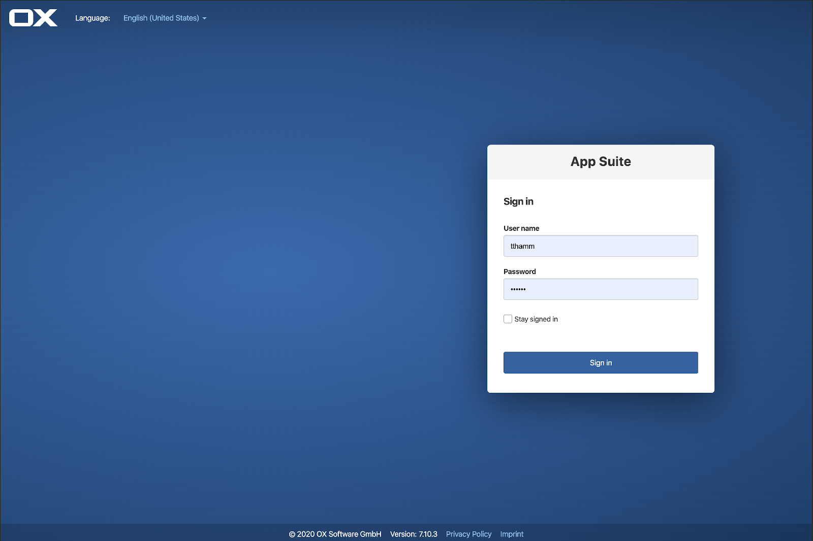
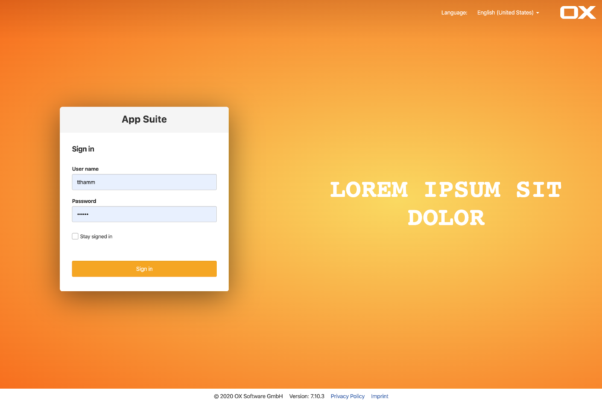
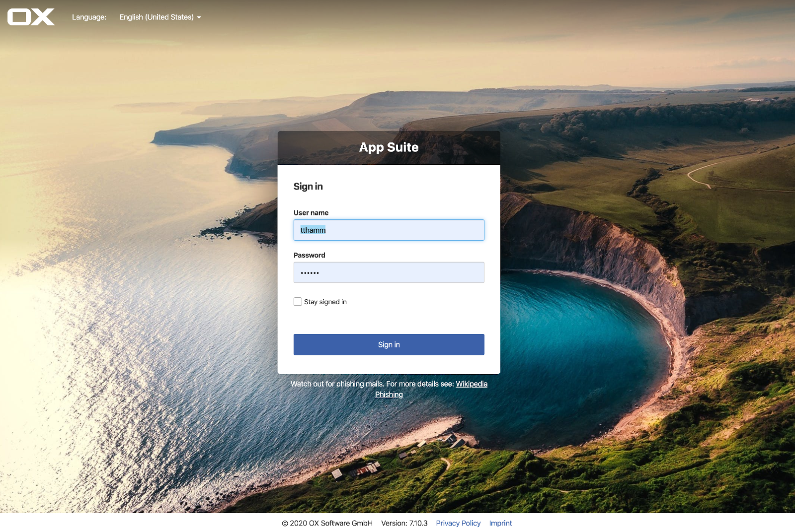

# Login page

With 7.10.4 a new, configurable login page has been introduced which offers a custom page without a custom theme. The configuration will be loaded as a part from the appsuite-configration. That means, it also supports multi-tenancy.

# Configuration
To configure the login page, different attributes in the `as-config.yml` can be set to change the appearance of the login screen. Every not configured property will fall back to its default.

To change the configuration, the properties in the config file `as-config.yml` need to be set.

```bash
  vim /opt/open-xchange/etc/as-config.yml
```

If changes were made, the `as-config.yml` has to be reloaded with the following command:

```bash
  /opt/open-xchange/sbin/reloadconfiguration
```

# Default configuration
The default configuration has the following structure and values:

```yaml
default:
    host: all
    loginPage:
        backgroundImage: "radial-gradient(at 33% 50%, #3b6aad, #1f3f6b)"
        backgroundColor: "radial-gradient(at 33% 50%, #3b6aad, #1f3f6b)"
        # teaser: "<div>any html ... </div>"
        logo: "data:image/svg+xml,%3Csvg width='180px' height='64px' viewBox='0 0 180 64' version='1.1' xmlns='http://www.w3.org/2000/svg' xmlns:xlink='http://www.w3.org/1999/xlink'%3E%3Cg fill='none' fill-rule='evenodd'%3E%3Cg id='ox_logo_white' fill='%23FFFFFF' fill-rule='nonzero'%3E%3Cpath d='M68.9893238,14.336 L68.9893238,49.664 C68.9893238,50.304 69.2455516,50.944 69.7259786,51.456 C69.2455516,50.976 68.6049822,50.72 67.9323843,50.72 L20.7544484,50.72 C20.113879,50.72 19.4733096,50.976 18.9928826,51.456 C19.4733096,50.976 19.7295374,50.304 19.7295374,49.664 L19.7295374,14.336 C19.7295374,13.696 19.4733096,13.056 18.9928826,12.544 C19.4733096,13.024 20.113879,13.28 20.7544484,13.28 L67.9323843,13.28 C68.5729537,13.28 69.2135231,13.024 69.7259786,12.544 C69.2455516,13.056 68.9893238,13.696 68.9893238,14.336 M88.6868327,45.568 L88.6868327,18.432 C88.6868327,8.256 80.4234875,0 70.2384342,0 L18.4483986,0 C8.2633452,0 0,8.256 0,18.432 L0,45.568 C0,55.744 8.2633452,64 18.4483986,64 L70.2384342,64 C80.4234875,64 88.6868327,55.744 88.6868327,45.568' id='Shape'%3E%3C/path%3E%3Cpath d='M133.046263,43.2 C133.046263,43.936 132.725979,44.608 132.245552,45.056 L114.822064,62.464 C113.893238,63.424 112.6121,64 111.170819,64 L86.1565836,64 L118.729537,31.456 C119.209964,31.008 119.818505,30.72 120.523132,30.72 C119.818505,30.72 119.177936,30.432 118.729537,29.984 L88.7188612,0 L115.846975,0 L132.245552,16.384 C132.758007,16.864 133.046263,17.504 133.046263,18.24 C133.046263,17.504 133.366548,16.832 133.846975,16.384 L150.245552,0 L177.373665,0 L147.330961,29.984 C146.850534,30.432 146.241993,30.72 145.537367,30.72 C146.241993,30.72 146.882562,31.008 147.330961,31.456 L179.935943,64 L154.921708,64 C153.480427,64 152.199288,63.392 151.270463,62.464 L133.846975,45.056 C133.33452,44.608 133.046263,43.936 133.046263,43.2' id='Path'%3E%3C/path%3E%3C/g%3E%3C/g%3E%3C/svg%3E"
        topVignette:
            transparency: "0.1"
        header:
            textColor: "#ffffff"
            linkColor: "#94c1ec"
            sorting: "$logo,$language,$spacer"
        loginBox: "right"
        form:
            textColor: "#333333"
            linkColor: "#94c1ec"
            header:
                title: "App Suite"
                bgColor: "#f5f5f5"
                textColor: "#333333"
            button:
                bgColor: "#3c61aa"
                borderColor: "#355697"
                textColor: "#ffffff"
        # informationMessage: "<div>any html ... </div>"
        footer:
            sorting: "$spacer,$copyright,Version: $version,$privacy,$imprint,$spacer"
            $privacy: "https://www.open-xchange.com/privacy/"
            $imprint: "https://www.open-xchange.com/legal/"
            copyright: "(c) $year OX Software GmbH"
            bgColor: "rgba(0, 0, 0, 0.15)"
            textColor: "#ffffff"
            linkColor: "#94c1ec"
        # customCss: "#any-selector { text-transform: uppercase; }"
```

# Properties
This sections describes how the different attributes are configured. All values are **strings** and the nested structure is mandatory.

## loginPage
The attribute 'loginPage' is the root level that contains the whole configuration of the login page.

<config>backgroundImage</config>
The attribute 'backgroundImage' sets the background. It can be used with any valid values within css 'background', like a color, gradient or image url.<br>
**Important:** For mobile devices the background image won't be set. The attribute 'backgroundColor' or its default will be visible.

examples

```yaml
backgroundImage: "#ddfbe6"
backgroundImage: "radial-gradient(at 33% 50%, #3b6aad, #1f3f6b)"
backgroundImage: "url(https://www.path-to-a-picture.jpg)"
```

<config>backgroundColor</config>
The attribute 'backgroundColor' is used as a layer beyond the image while it's getting loaded or if the image can't be loaded at all. It can be used with any valid values within css 'background', like a color, gradient or image url.

<config>teaser</config>
The value of the attribute 'teaser' will be interpreted as HTML to display custom content next to the login box. The teaser will not be shown if the login box is centered (see `loginBox`) or the screen is too small.

<config>logo</config>

The logo can be an image url or SVG.

examples

```yaml
logo: "https://www.open-xchange.com/typo3conf/ext/sem_ox_content/Resources/Public/Images/ox-logo-new.png"
logo: "data:image/svg+xml,%3Csvg width='180px' height='64px' viewBox='0 0 180 64' version='1.1' xmlns='http://www.w3.org/2000/svg' xmlns:xlink='http://www.w3.org/1999/xlink'%3E%3Cg fill='none' fill-rule='evenodd'%3E%3Cg id='ox_logo_white' fill='%23FFFFFF' fill-rule='nonzero'%3E%3Cpath d='M68.9893238,14.336 L68.9893238,49.664 C68.9893238,50.304 69.2455516,50.944 69.7259786,51.456 C69.2455516,50.976 68.6049822,50.72 67.9323843,50.72 L20.7544484,50.72 C20.113879,50.72 19.4733096,50.976 18.9928826,51.456 C19.4733096,50.976 19.7295374,50.304 19.7295374,49.664 L19.7295374,14.336 C19.7295374,13.696 19.4733096,13.056 18.9928826,12.544 C19.4733096,13.024 20.113879,13.28 20.7544484,13.28 L67.9323843,13.28 C68.5729537,13.28 69.2135231,13.024 69.7259786,12.544 C69.2455516,13.056 68.9893238,13.696 68.9893238,14.336 M88.6868327,45.568 L88.6868327,18.432 C88.6868327,8.256 80.4234875,0 70.2384342,0 L18.4483986,0 C8.2633452,0 0,8.256 0,18.432 L0,45.568 C0,55.744 8.2633452,64 18.4483986,64 L70.2384342,64 C80.4234875,64 88.6868327,55.744 88.6868327,45.568' id='Shape'%3E%3C/path%3E%3Cpath d='M133.046263,43.2 C133.046263,43.936 132.725979,44.608 132.245552,45.056 L114.822064,62.464 C113.893238,63.424 112.6121,64 111.170819,64 L86.1565836,64 L118.729537,31.456 C119.209964,31.008 119.818505,30.72 120.523132,30.72 C119.818505,30.72 119.177936,30.432 118.729537,29.984 L88.7188612,0 L115.846975,0 L132.245552,16.384 C132.758007,16.864 133.046263,17.504 133.046263,18.24 C133.046263,17.504 133.366548,16.832 133.846975,16.384 L150.245552,0 L177.373665,0 L147.330961,29.984 C146.850534,30.432 146.241993,30.72 145.537367,30.72 C146.241993,30.72 146.882562,31.008 147.330961,31.456 L179.935943,64 L154.921708,64 C153.480427,64 152.199288,63.392 151.270463,62.464 L133.846975,45.056 C133.33452,44.608 133.046263,43.936 133.046263,43.2' id='Path'%3E%3C/path%3E%3C/g%3E%3C/g%3E%3C/svg%3E"
```

<config>loginBox</config>
The attribute 'loginBox' describes the position of the login box on the page: `left`, `right` or `centered`.

<config>informationMessage</config>
The value of the attribute 'informationMessage' will be interpreted as HTML to display custom content below the login box. It will not be shown on mobile devices.

<config>customCss</config>
With attribute 'customCss' custom css rules can be applied for elements within the `div id="io-ox-login-screen"`. Note that the css rules will be scoped to the `io-ox-login-screen` id such that no other elements outside of the login page get affected.

### Section "topVignette":
To get a better contrast for the page header, a vignette shadow at the top of the page can be set. This is useful if the background of the login page is too bright and it gets hard to read the text of the header.

<config>transparency</config>
This sets the transparency of the top vignette between 0 and 1. Please note, that this is also a **string**.

### Section "header":
This section describe elements inside the header. The header elements are those, displayed in the top bar.

<config>textColor</config>
The attribute 'textColor' sets the color of the text within the header. Any valid values for css 'color' can be used.

<config>linkColor</config>
The attribute 'linkColor' sets the color of links within the header. Any valid values for css 'color' can be used.

<config>sorting</config>
The attribute 'sorting' describes the order of the [header](#section-header) elements logo and language selector. It expecteds a comma separated list of elements, each element starting with `$`. Possible elements are `$language`, `$logo` and `$spacer`. The `$spacer` is used to determine the alignment of the element.
If the first element is the `$spacer`, following elements will be right aligned. If the `$spacer` is between `$logo` and `$language`, the logo will be left and the language selector will be right aligned.

### Section "form":
The form attributes describe the appearance of the login box.

<config>textColor</config>
The attribute 'textColor' sets the color of the text within the login box. Any valid values for css 'color' can be used.

<config>linkColor</config>
The attribute 'linkColor' sets the color of links within the login box. Any valid values for css 'color' can be used.

<config>header</config>
The header attributes describe the header of the login box.

- **title**: The attribute 'title' will be displayed as a string on top of the login box or on mobile devices in the header.
- **bgColor**: The attribute 'bgColor' sets the background like the css attribute 'background' (color, gradient, image url).
- **textColor**: The attribute 'textColor' sets the color of the text. Any valid values for css 'color' can be used.

<config>button</config>
The attributes in the button section describe the buttons within the login box.

- **bgColor**: The attribute 'bgColor' sets the background color the button and overwrites its default border color if it wasn't set by the attribute 'borderColor'.
- **borderColor**: The attribute 'borderColor' sets the border color of the button.
- **textColor**: The attribute 'textColor' sets the text color of the button. Any valid values for css 'color' can be used.

### Section "footer":
The attributes of the footer section describe the elements displayed at the bottom of the login page.

<config>sorting</config>
The attribute 'sorting' describes the order of the footer elements. There can be set multiple `$spacer` elements to align the elements the same way it's described for the 'sorting' attribute of the page header.

<config>$privacy</config>
The attribute '$privacy' sets the link url to the privacy policy.

<config>$imprint</config>
The attribute '$imprint' sets the link url to the legal.

<config>copyright</config>
The attribute 'copyright' describes the copyright text. The placeholder `$year` will be replaced by the current year, `(c)` will be replaced by the unicode copyright sign.

<config>bgColor</config>
The attribute 'bgColor' sets the background color of the footer like the css attribute 'background'. Transparency can be achieved with RGBA values.

<config>textColor</config>
The attribute 'textColor' sets the text color within the footer. Any valid values for css 'color' can be used.

<config>linkColor</config>
The attribute 'linkColor' sets the color of links within within the footer. Any valid values for css 'color' can be used.

# Localization and parsing

The login page configuration provides a translation feature that allows to implement some localization strings into the login page. The functionality is also implemented for some standard properties. You can assign a single string or an object with multiple languages to the following properties: **$imprint**, **$privacy**, **title**, **teaser**, **informationMessage**. Therefor `en_US` is mandatory and works as a fallback if a language is not supported.

```yaml
$imprint: "www.this-will-always-be-the-same-link.com",
$privacy: { en_US: "www.foo.bar/en", de_DE: "www.foo.bar/de" }
```

The title can also be localized as shown in the following code example.

```yaml
title: { en_US: 'App Suite - Hello', es_ES: 'App Suite - Hola', de_DE: 'App Suite - Hallo' }
```

If an html property shall be localized you have to assign two versions of the whole html code to the property.

```yaml
teaser: "<div>As a single string it stays the same.</div>",
informationMessage: { en_US: "<div>This is an English HTML text.</div>", de_DE: "<div>Dies ist ein deutscher HTML Text.</div>" }
```

You can also add some user defined elements to the sortings of the header and footer which support translation as well. To do this you need to name an element that is prefixed with a '$' sign. Insert the variable into the sorting like described in the section [Header](#section-header) or [Footer](#section-footer). Afterwards you have to define the value of the element at the same hierarchical level like shown in the following example:

```yaml
header:
    sorting: "$spacer,$myProp,$mySecondProp,$language,$logo",
    $myProp: "I am a simple text that never changes.",
    $mySecondProp: { en_US: "Welcome", de_DE: "Willkommen" }
```

# Multi tenancy

For each tenant an own login page configuration can be set by setting the attributes for the different hosts like it is described in [Custom Host Configuration]({{ site.baseurl }}/middleware/administration/custom_host_configuration.html).

# Example configurations

**Default login page** (see section [Default configuration](#default-configuration))




**Orange theme example**



```yaml
default:
    host: all
    loginPage:
        backgroundImage: "radial-gradient(at 66% 50%, #FAD961, #F76B1C)"
        backgroundColor: "radial-gradient(at 66% 50%, #FAD961, #F76B1C)"
        teaser: "<div style=\"display: flex;flex-direction: column;justify-content: center;height: 100%;\"><h1 style=\"text-transform: uppercase;font-family: monospace;font-size: 64px;text-align: center;font-weight: 700;\">lorem ipsum sit dolor</h1></div>"
        topVignette:
            transparency: "0.1"
        header:
            textColor: "#FFFFFF"
            linkColor: "#FFFFFF"
            sorting: "$spacer,$language,$logo"
        loginBox: "left"
        form:
            textColor: "#333333"
            linkColor: "#7A707A"
            header:
                title: "App Suite"
                bgColor: "#F5F5F5"
                textColor: "#333333"
            button:
                bgColor: "#F5A623"
                textColor: "#FFFFFF"
        footer:
            sorting: "$spacer,$copyright,Version: $version,$privacy,$imprint,$spacer"
            $privacy: "https://www.open-xchange.com/privacy/"
            $imprint: "https://www.open-xchange.com/legal/"
            copyright: "(c) $year OX Software GmbH"
            bgColor: "#FFFFFF"
            textColor: "#333333"
            linkColor: "#4064AC"
```


**Picture theme example**



```yaml
default:
    host: all
    loginPage:
        backgroundImage: "url(https://images.pexels.com/photos/462162/pexels-photo-462162.jpeg?auto=compress&cs=tinysrgb&dpr=2&h=750&w=1260)"
        backgroundColor: "radial-gradient(at 33% 50%, #3b6aad, #1f3f6b)"
        topVignette:
            transparency: "0.5"
        header:
            textColor: "#ffffff"
            linkColor: "#ffffff"
            sorting: "$logo,$language,$spacer"
        loginBox: "center"
        form:
            textColor: "#333333"
            linkColor: "#3C61AA"
            header:
                title: "App Suite"
                bgColor: "rgba(0, 0, 0, 0.50)"
                textColor: "#ffffff"
            button:
                bgColor: "#3C61AA"
                textColor: "#ffffff"
        informationMessage: "<div style=\"text-align: center; color: #ffffff\">Watch out for phishing mails. For more details see: <a style=\"color: #ffffff;text-decoration: underline\" href=\"https://en.wikipedia.org/wiki/Phishing\">Wikipedia Phishing</a></div>"
        footer:
            sorting: "$spacer,$copyright,Version: $version,$privacy,$imprint,$spacer"
            $privacy: "https://www.open-xchange.com/privacy/"
            $imprint: "https://www.open-xchange.com/legal/"
            copyright: "(c) $year OX Software GmbH"
            bgColor: "#ffffff"
            textColor: "#333333"
            linkColor: "#3C61AA"
```

# Forgot password

There are two methods during the login where you can request a new password: **Default login page** and **Guest login method**

## Default login page

On the initial login screen, a password forgot link can be enabled by setting a value for the attribute 'forgotPassword' in the server configuration `as-config.yml`. The value describes the path to the providers page where a user can reset the password. If the value is not set, the link to reset the password will not be shown.

```yaml
default:
    host: all
    forgotPassword: "path/to/provider-forgot-password-page"
```

## Guest login method

If you access the login page via the guest login method, e.g. after clicking on a sharing link of a password protected file, you can enter your email address directly. An email with the password reset intructions will be sent by the App Suite.
