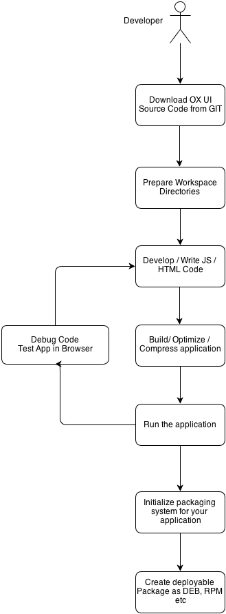

Hello and welcome to the world of OX App Suite development.
This document is designed to get you started with developing your first app for OX App Suite as quickly and simply as possible.
However, along the way we will also tempt you to learn more by linking to some more in-depth documentation about the various topics we cover.



# Installing the Development Tools

First, you need to install some tools which are necessary for UI development.

TL;DR version:

```bash
$ npm install -g grunt-cli bower yo generator-ox-ui-module
```

Or if needed, there is a complete article about setting up an environment for [grunt](http://oxpedia.org/wiki/index.php?title=AppSuite:GettingStartedWithGrunt#Node).

# Create a Workspace

All your app development can take place inside one working directory.
The examples will assume you have created a directory named myapp inside your home directory:

```bash
$ mkdir ~/myapp
$ cd ~/myapp
```

It doesn't need to be in your home directory, and the actual name should reflect the name of your app.
The main point is that all commands will be executed in this directory and all paths will be relative to this directory from now on.

Now, you can generate a grunt configuration using:

``` bash
$ yo ox-ui-module
```

The source code of your app will reside in the subfolder named apps.
To avoid name collisions please pick a unique subfolder inside that.
The easiest and recommended way is to use a domain name that you own. Typically, the domain elements are reversed, like in Java. example.com becomes com.example:

```bash
$ mkdir -p apps/com.example
```

# Writing an App

As an example, let's create the smallest possible app and test it.
It requires only two files: apps/com.example/register.js for the source code of the app:

```javascript
define('com.example/register', function () {
    'use strict';
    alert('Hello, World!');
});
```


and apps/com.example/manifest.json for the manifest which tells the UI that your app exists and what to do with it:

```
{ "namespace": "core" }
```

# Building an App

The source code of your app can't be used by OX App Suite as it.
It first has to be processed by the build system.
This step will check the source code for syntax errors, compress it, and depending on the structure of your code, many other things.
The processed code is then written to a directory named build by default. Start the build with this command:

```bash
$ grunt
```


If your editor supports it, you can configure it to call the build system after every file save.
Take care to call it from the top directory of your app's workspace, not from the directory of the saved file.

# Testing an App

The freshly built code can now be tested.
Instead of uploading your code to an OX App Suite server, you can use the appserver proxy to inject your code into the UI code of any existing OX App Suite installation.
For example, to start appserver using www.ox.io as the server, you will need a local configuration pointing to that server.
You can register for a free user account on www.ox.io.

You can generate it with this command:

``` bash
$ grunt show-config:local --output grunt/local.conf.json
```

To use the remote www.ox.io AppSuite server, open up the file grunt/local.conf.json in your editor and add ``https://www.ox.io/appsuite/`` to the server setting of the appserver section.
Also make sure that the protocol setting is set to https.
Else you will get https redirect errors in your browser.

INFO: If you are using a locally installed AppSuite server (in a VM or similar in your local network), just modify the server + protocol accordingly.

Then start the development server:

```bash
$ grunt dev
```

This command will serve your app from the local directory build, and get everything else from the URL specified in the server setting.

Once appserver is running, you can access OX App Suite by opening your browser using this address:

[https://localhost:8337/appsuite](https://localhost:8337/appsuite)

After logging in, the app should be loaded and display the alert message.

## Development cycle

Once you are sure that your setup works, you can extend the example and write the actual code for your app.
The dev task will detect any changes and rebuild your app and even reload all browsers connected to [https://localhost:8337/appsuite](https://localhost:8337/appsuite).

While developing always keep in mind, that there is an [article about debugging the user interface](http://oxpedia.org/wiki/index.php?title=AppSuite:Debugging_the_UI) which helps you avoid and fix typical errors.

# Packaging

Together with our ox-ui-module generator (from version 0.8.0), we provide you with generators for packaging information.

To enable some grunt tasks to help you, you can optionally install (with npm install) grunt-contrib-compress and grunt-exec.
You will need those to run the grunt tasks described below.

## Generating a source tarball

There is a grunt tasks to create source packages.
You can use it to create a tar.gz file containing all sources needed to build the project.
This source package should contain all dependencies that are installed during bower install and npm install (basically containing your bower_components and node_modules directories).
To generate this file, run:

```bash
$ grunt dist:source --include-dependencies
```

This file (can be found in the dist/ directory) together with the distribution specific packaging information will be needed to build the package.

## RPM packages

In order to generate a spec file for your project, run:

```bash
$ yo ox-ui-module:rpm-pkg
```

Will generate a spec file, with some default values read from your package.json file.
So you might want to make this file as complete as possible.
However, yeoman will ask you about the information missing.

Please remember, that the generated spec file is only a scaffold for a real one.
It will work for very simple cases, but as soon as your package gets more complicated, you will have to adjust it to your needs.

Once you have the spec file in your project, you can use

```bash
$ grunt rpm-build --include-dependencies
# or rpm-build if you are on shared-grunt-config-0.6.0
```

## DEB packages

Creating packages for the Debian distribution works similar to rpm packages. Just run:

```bash
$ yo ox-ui-module:deb-pkg
```


This will generate a debian directory containing all needed files.
Some default values will be read from your package.json file.
So you might want to make this file as complete as possible.
However, yeoman will ask you about the information missing.

_Please remember, that the generated spec file is only a scaffold for a real one._
_It will work for very simple cases, but as soon as your package gets more complicated, you will have to adjust it to your needs._

Once you have a debian/ directory for your project, you can go on.
Now you can run:

```bash
$ grunt dpkg-buildpackage --include-dependencies
```

# i18n

To use the proven way to translate your AppSuite application, you should now check out the [documentation](http://oxpedia.org/wiki/index.php?title=AppSuite:I18n) about all [i18n](http://oxpedia.org/wiki/index.php?title=AppSuite:I18n) tasks.
Please browse to the [i18n](http://oxpedia.org/wiki/index.php?title=AppSuite:I18n) page.

# Further Reading

+ Congratulations you have just built your first app for OX App Suite, but please keep in mind that there are [quite a few options](http://oxpedia.org/wiki/index.php?title=AppSuite:Developing_for_the_UI#What_can_i_build.3F) for developing for OX App Suite.
+ In case you want to upgrade your existing app for OX App Suite, read [the upgrade guide](http://oxpedia.org/wiki/index.php?title=AppSuite:Upgrade_app_using_yo).
+ More information on the build system can be found on github:
    + [See all available grunt tasks](https://github.com/Open-Xchange-Frontend/shared-grunt-config)
    + [Documentation of all generator tasks](https://github.com/Open-Xchange-Frontend/generator-ox-ui-module)
+ If you're stuck somewhere, the article about [debugging the UI](http://oxpedia.org/wiki/index.php?title=AppSuite:Debugging_the_UI) might help you.
+ You can read this to get a better overview of [developing the user inferface](http://oxpedia.org/wiki/index.php?title=AppSuite:Developing_for_the_UI).
