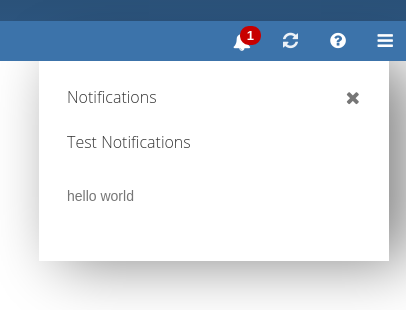
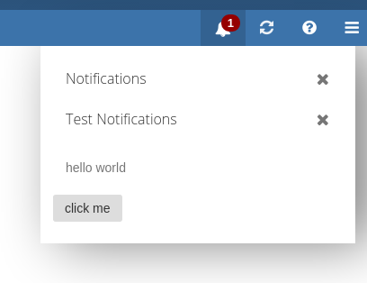
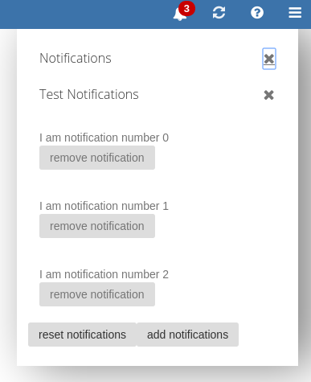
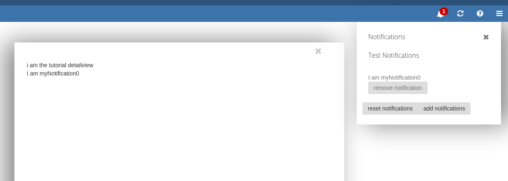

This article is a step by step tutorial to build your own notification plugin. These plugins can be used for various purposes, for example reminding the user of something or showing him new invitations.

__Download__

You can download the full examplecode here:
[notification780_tutorial.zip](notification780_tutorial.zip)

# Basic Notification

First let's start with showing the most basic notification plugin you can write. 
Create a file named ``register.js`` at ``plugins/notifications/tutorial``.

This code just adds a simple hello world notification:


```javascript
define('plugins/notifications/tutorial/register', [
    'io.ox/core/extensions',
    'io.ox/core/notifications/subview'
], function (ext, Subview) {

    'use strict';

    ext.point('io.ox/core/notifications/tutorial/item').extend({
        draw: function () {
            this.append( $('<span>').text('hello world'));
        }
    });

    ext.point('io.ox/core/notifications/register').extend({
        id: 'tutorialplugin',
        index: 1000,
        register: function () {
            var options = {
                    id: 'io.ox/tutorialplugin',
                    title: 'Test Notifications',
                    extensionPoints: {
                        item: 'io.ox/core/notifications/tutorial/item'
                    }
                },
                subview  = new Subview(options);

            subview.resetNotifications({ id: 'myNotification1' });
        }
    });

    return true;
});

```

This code extends two extension points: _io.ox/core/notifications/tutorial/item_ and _io.ox/core/notifications/register_ and uses _io.ox/core/notifications/subview_ to create the subview needed for our plugin.

We use ``io.ox/core/notifications/tutorial/item`` to draw our notification items. 
Here it's a simple hello world text.

``io.ox/core/notifications/register`` is used by the notification area to load the different plugins. 
Those plugins are implemented as subviews of the main notification area. 
The index determines the order of the different subviews. 
We define some options for our view here:

- id: the internalId for our subview
- title: the text in the header of our subview
- extensionPoints: here we tell the subview which extensionpoints to use when drawing our notifications. For now we only use io.ox/core/notifications/tutorial/item to draw our items.

More options will be explained later on.

Now we create our subview and add a notification to it:

```javascript
subview  = new Subview(options);
subview.resetNotifications({ id: 'myNotification1' });
```

# Manifest

To load our code we need to add a ``manifest.json`` file at ``plugins/notifications/tutorial`` with the following contents:


```json
{
    "namespace": "io.ox/core/notifications",
    "requires": ""
}
```

This manifest makes sure our code is loaded. 
You can also define capabilities like webmail here, if your notifications require specific capabilities to be enabled. 
They only show up if a user has these capabilities.

# Testing our notification

Now it's time to test our notification. 
Build the UI and add &customManifests=true to the url, because our manifest is only present locally.

After reloading you should see something like this:



# Expanding our Plugin

We can add more functionality to our plugin by using the options when creating the subview. Here are some more:

- showHideAllButton: Is used to show a hide all button for your subview. This button hides all current notifications of your subview. Default is false
- hideAllLabel: Is the aria-label for the hide all button that is used by screen readers. Default is empty string
- showHideSingleButton: Is used to show a hide button for your notifications. This button hides a single notification of your subview. Default is true
- max: The maximum number of displayed notifications in this subview. The actual collection may contain more. Setting this to null will show all notifications. Default is 10
- autoOpen: Used to open the notification area, if there is a new notification for your plugin. You may want to tie this to a user setting. Default is false
- extensionPoints: This is an object where you can define extension points used when drawing your subview. Possible points are:
    - main: The main extension point. If you overwrite this you can draw the subview completely by hand. If you keep the default value, this extension point invokes the header, item and footer extension points for you.
    - header: The extension point for your subview header. The default extension point uses the supplied title attribute and draws the hideall button if enabled.
    - item: The extension point for a single notifications. This extension point has no default value and must be provided by the plugin when creating the subview. In our example this was io.ox/core/notifications/tutorial/item.
    - footer: The extension point for the footer. If your subview should have a footer you can provide an extension point for this. There is no default extension point and it's entirely optional.

Let's add a footer to our plugin and make it autopen. The code looks like this:


```javascript
define('plugins/notifications/tutorial/register', [
    'io.ox/core/extensions',
    'io.ox/core/notifications/subview'
], function (ext, Subview) {

    'use strict';

    ext.point('io.ox/core/notifications/tutorial/footer').extend({
        draw: function () {
            this.append($('<button class="btn">').text('click me')
                .on('click', function () {
                    alert('footer button was clicked');
                }));
        }
    });

    ext.point('io.ox/core/notifications/tutorial/item').extend({
        draw: function () {
            this.append($('<span>').text('hello world'));
        }
    });

    ext.point('io.ox/core/notifications/register').extend({
        id: 'tutorialplugin',
        index: 1000,
        register: function () {
            var options = {
                    id: 'io.ox/tutorialplugin',
                    title: 'Test Notifications',
                    extensionPoints: {
                        item: 'io.ox/core/notifications/tutorial/item',
                        footer: 'io.ox/core/notifications/tutorial/footer'
                    },
                    autoOpen: true
                },
                subview  = new Subview(options);

            subview.resetNotifications({ id: 'myNotification1' });
        }
    });

    return true;
});
```

And it should look like this:



# Adding and removing notifications

Now we need to talk about how notifications are added and removed. 
Our subview has a backbone collection which stores all it's notifications. 
The notifications need an id so the collection can avoid duplicates and handle hiding correctly. 
Our example notifications id was _myNotification1_. This collection can be changed by using 3 methods:

- addNotifications: Adds notifications to the collection. Only adds notifications which have a new id. Has 2 parameters:
    - items: Is a single object or an array of objects to be added as new notifications.
    - silent: Is a boolean that can be set to true if the new notifications should be added silently. This prevents immediate redrawing.
- removeNotifications: Removes notifications from the collection. Has items and silent parameter, like addNotifications.
- resetNotifications: Resets the collection. This throws away all notifications in the collection and fills it with the provided new ones. Can also be used to clear the collection, when an empty array is provided. Again has items and silent parameter, like addNotifications.


Let's expand our example by adding buttons to the footer to add notifications and reset them. 
Let's also add a button to remove a notification and show some data in our notifications.

The code looks like this:


```javascript
var counter = 0;

    ext.point('io.ox/core/notifications/tutorial/footer').extend({
        draw: function (baton) {
            this.append($('<button class="btn">').text('reset notifications')
                .on('click', function () {
                    counter = 0;
                    baton.view.resetNotifications({ id: 'myNotification' + counter, text: 'I am notification number ' + counter });
                    counter++;
                }),
                $('<button class="btn">').text('add notifications')
                .on('click', function () {
                    baton.view.addNotifications({ id: 'myNotification' + counter, text: 'I am notification number ' + counter });
                    counter++;
                }));
        }
    });

    ext.point('io.ox/core/notifications/tutorial/item').extend({
        draw: function (baton) {
            this.append($('<div>').text(baton.model.get('text')),
                $('<button class="btn">').text('remove notification').on('click', function () {
                    baton.view.removeNotifications(baton.model);
                }));
        }
    });

```


The extension points are provided a baton which has the data of the view and the model. Here we have a new text attribute in our notification models that we display. We use a simple counter here to create unique ids.

You should see something like this in your browser:



# Using APIs

Instead of manually adding or reseting notifications. The subview is also capable of handling APIs that meet certain conditions.

To use APIs the subview provides the following options:

- api: The API object that should be used by this subview. default is null,
- apiEvents: An object where you can define events that the subview should listen to:
    - add: A string that contains the events the API triggers when notifications should be added. The provided data is used by the addNotifications function.
    - remove: A string that contains the events the API triggers when notifications should be removed. The provided data is used by the removeNotifications function.
    - reset: A string that contains the events the api triggers when notifications should be reseted. The provided data is used by the resetNotifications function.
- fullModel: Some notifications have limited data and the full data must be requested from the server (our notifications usually only have id and folder). To do this the API must provide a get function that returns the full model data as the result of a deferred object. The model attributes are provided to the API.get function. If fullModel is set to true, there is no API call to get the full data as the model already has it. Default is false,
- useListRequest: If data should be requested by the server, it can be done as a list request instead of multiple get requests. The API must have a matching list function for this. Default is 'false'.

This is designed to fit our core APIs like mail or calendar, but custom APIs should work as well.

Let's change our example to use a small api:


```javascript
define('plugins/notifications/tutorial/register', [
    'io.ox/core/extensions',
    'io.ox/core/notifications/subview',
    'io.ox/core/event'
], function (ext, Subview, Events) {

    'use strict';

    var counter = 0;

    var api = {
        get: function (data) {
            var result = {
                id: data.id,
                text: 'I am ' + data.id
            };
            return $.Deferred().resolve(result);
        },
        reset: function () {
            counter = 0;
            api.trigger('reset', { id: 'myNotification' + counter });
            counter++;
        }
    };

    Events.extend(api);

    ext.point('io.ox/core/notifications/tutorial/footer').extend({
        draw: function (baton) {
            this.append($('<button class="btn">').text('reset notifications')
                .on('click', function () {
                    api.reset();
                }),
                $('<button class="btn">').text('add notifications')
                .on('click', function () {
                    baton.view.addNotifications({ id: 'myNotification' + counter });
                    counter++;
                }));
        }
    });

    ext.point('io.ox/core/notifications/tutorial/item').extend({
        draw: function (baton) {
            this.append($('<div>').text(baton.model.get('text')),
                $('<button class="btn">').text('remove notification').on('click', function () {
                    baton.view.removeNotifications(baton.model);
                }));
        }
    });

    ext.point('io.ox/core/notifications/register').extend({
        id: 'tutorialplugin',
        index: 1000,
        register: function () {
            var options = {
                    id: 'io.ox/tutorialplugin',
                    title: 'Test Notifications',
                    extensionPoints: {
                        item: 'io.ox/core/notifications/tutorial/item',
                        footer: 'io.ox/core/notifications/tutorial/footer'
                    },
                    autoOpen: true,
                    api: api,
                    apiEvents: {
                        reset: 'reset'
                    }
                };
            new Subview(options);

            api.reset();
        }
    });

    return true;
});
```

Usally you would have the API in a separate file but in our example we keep it with the other code for simplicity. 
Also note that this API just works as a dummy, normally you would use server requests etc to get your data, but depending on the design of your API this may vary.

In our example the reset function is now handled by the API. 
It throws a reset event that we also added to the options of our subview, so that it listens to it properly. 
We also use the get function here to get additional data. 
If your API does not need additional data and should only use the initial data provided when the notification was created, just set the _fullModel_ option to true. 
Note that the API extends _io.ox/core/event_. 
This is needed so the event listeners function properly.

# Adding Detailviews

Most notifications provide detailviews. Those views open when you click on a notification. For example a reminder shows the calendar appointment or task.

You can add a detailview by adding the detailview option. This can be a string for our require module, like _io.ox/calendar/view-detail_. Or it can be a normal object. Important is that it provides either a view constructor or a draw function. The data is provided either by the API (_fullModel = false_), or the data from the collection is used (_fullModel = true_). To get the right data the DOM node of the notification needs a data-cid attribute that contains the id for either API or collection.

In our code this would look like this:


```javascript
define('plugins/notifications/tutorial/register', [
    'io.ox/core/extensions',
    'io.ox/core/notifications/subview',
    'io.ox/core/event'
], function (ext, Subview, Events) {

    'use strict';

    var counter = 0;

    var api = {
        get: function (data) {
            var result = {
                id: data.id,
                text: 'I am ' + data.id
            };
            return $.Deferred().resolve(result);
        },
        reset: function () {
            counter = 0;
            api.trigger('reset', { id: 'myNotification' + counter });
            counter++;
        }
    };

    Events.extend(api);

    ext.point('io.ox/core/notifications/tutorial/footer').extend({
        draw: function (baton) {
            this.append($('<button class="btn">').text('reset notifications')
                .on('click', function () {
                    api.reset();
                }),
                $('<button class="btn">').text('add notifications')
                .on('click', function () {
                    baton.view.addNotifications({ id: 'myNotification' + counter });
                    counter++;
                }));
        }
    });

    ext.point('io.ox/core/notifications/tutorial/item').extend({
        draw: function (baton) {
            var cid = _.cid(baton.model.attributes);

            this.attr('data-cid', cid).append($('<div>').text(baton.model.get('text')),
                $('<button class="btn">').text('remove notification').on('click', function () {
                    baton.view.removeNotifications(baton.model);
                }));
        }
    });

    ext.point('io.ox/core/notifications/register').extend({
        id: 'tutorialplugin',
        index: 1000,
        register: function () {
            var options = {
                    id: 'io.ox/tutorialplugin',
                    title: 'Test Notifications',
                    extensionPoints: {
                        item: 'io.ox/core/notifications/tutorial/item',
                        footer: 'io.ox/core/notifications/tutorial/footer'
                    },
                    autoOpen: true,
                    api: api,
                    apiEvents: {
                        reset: 'reset'
                    },
                    detailview: {
                        draw: function (obj) {
                            var node = $('<div>').append($('<div>').text('i am the tutorial detailview'),
                                $('<div>').text(obj.data.text));
                            return node;
                        }
                    }
                };
            new Subview(options);

            api.reset();
        }
    });

    return true;
});
```

We use a simple object with a draw function. 
It's important that this function returns one jquery node.
Also note that we added a data-cid attribute, so the API can lookup the correct item.

In the browser it looks like this:



# Adding desktop notifications

Finally you can add desktop notifications. This notifications are shown by the browser, if the appsuite is minimized or the tab is not active at the moment. The subview can show individual notifications, if there is only one new item or a more generic notification, if there are multiple new items.

To use it you can use the following options:

- desktopNotificationSupport: If you want to use desktop notifications this has to be true. Default is true
- genericDesktopNotification: This is the desktop notification shown when there are multiple new notifications or if there is no specific one. Accepts all attributes io.ox/core/desktopNotifications.show accepts. Default is:

```javascript
{
    title: gt('New notifications'),
    body: gt('You\'ve got new notifications'),
    icon: ''
}
```
- specificDesktopNotification: Function that is called when there is only one new notification. The notifications data is provided as a model. Default is null.

Adding a specific notification to our example would look like this:


```javascript
define('plugins/notifications/tutorial/register', [
    'io.ox/core/extensions',
    'io.ox/core/notifications/subview',
    'io.ox/core/event'
], function (ext, Subview, Events) {

    'use strict';

    var counter = 0;

    var api = {
        get: function (data) {
            var result = {
                id: data.id,
                text: 'I am ' + data.id
            };
            return $.Deferred().resolve(result);
        },
        reset: function () {
            counter = 0;
            api.trigger('reset', { id: 'myNotification' + counter });
            counter++;
        }
    };

    Events.extend(api);

    ext.point('io.ox/core/notifications/tutorial/footer').extend({
        draw: function (baton) {
            this.append($('<button class="btn">').text('reset notifications')
                .on('click', function () {
                    api.reset();
                }),
                $('<button class="btn">').text('add notifications')
                .on('click', function () {
                    baton.view.addNotifications({ id: 'myNotification' + counter });
                    counter++;
                }));
        }
    });

    ext.point('io.ox/core/notifications/tutorial/item').extend({
        draw: function (baton) {
            var cid = _.cid(baton.model.attributes);

            this.attr('data-cid', cid).append($('<div>').text(baton.model.get('text')),
                $('<button class="btn">').text('remove notification').on('click', function () {
                    baton.view.removeNotifications(baton.model);
                }));
        }
    });

    ext.point('io.ox/core/notifications/register').extend({
        id: 'tutorialplugin',
        index: 1000,
        register: function () {
            var options = {
                    id: 'io.ox/tutorialplugin',
                    title: 'Test Notifications',
                    extensionPoints: {
                        item: 'io.ox/core/notifications/tutorial/item',
                        footer: 'io.ox/core/notifications/tutorial/footer'
                    },
                    autoOpen: true,
                    api: api,
                    apiEvents: {
                        reset: 'reset'
                    },
                    detailview: {
                        draw: function (obj) {
                            var node = $('<div>').append($('<div>').text('i am the tutorial detailview'),
                                $('<div>').text(obj.data.text));
                            return node;
                        }
                    },
                    specificDesktopNotification: function (model) {
                        return {
                            title: 'New tutorial notification',
                            body: model.get('text'),
                            icon: ''
                        };
                    }
                };
            new Subview(options);

            api.reset();
        }
    });

    return true;
});
```

