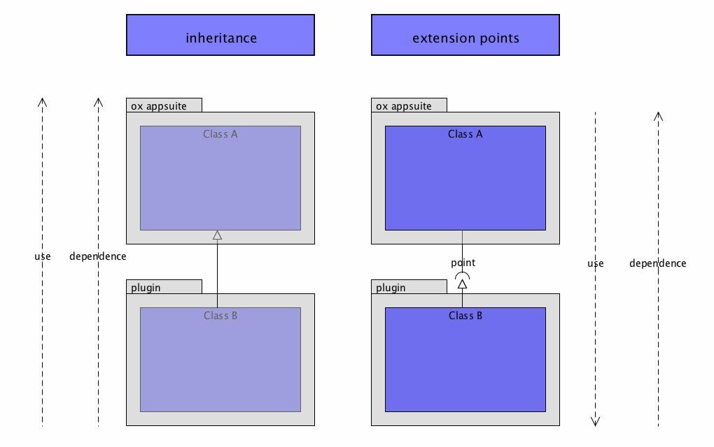

Abstractly speaking extension points are an architecture for letting plugins contribute functionality to other parts of the program. 
They form the core of the OX App Suite plugin architecture.
A less detailed hands-on introduction can be found here. 
Some basics about the extention point concept and advantages compared to inheritance.

# Introduction

## Inheritance vs. Extension points

OX App Suite uses the extension point concept to create extension points that allow a simple and flexible way to extending functionality. 
When system reaches a part that can be extended it asks a central registry if extensions are registered. 
In that case these extensions will be executes independent of the providing component (some plugin or OX App Suite itself).

The illustrated example compares inheritance and extension points. 
The main benefit of using extension points is that the programm is still the active component and it's in controll. 
This leads to the following advantages:

- Reduced coupling
- Increased cohesion
- Modularity- Re-usability
- Dynamic



## Some characteristics

- good fences: extension points unregister corrupt extenders
- lazy loading: extenders are loaded if they are used
- fair play: all extenders have equal rights
- diversity: extension points support different extension

## Components

The extension point system lives in the ``io.ox/core/extensions`` module and consists of these elements:

- extension point system: accessing the outer parts
- registry: manages extension points, extensions and their state
- extension point: part of the systems that can be extended, referenced by a
unique id 
- extension: adding/replacing functionality during runtime, referenced by a unique id
- baton: object used to store context, passed back through callbacks

# Extension Point System

```javascript
 //load extension points module
 require(['io.ox/core/extensions'], function (ext) {
     //insert code here
 });
```

# Registry

- manages extension points, extensions and their state

## list points


```javascript
// returns array of point ids
var keys = ext.keys();
```

## get/create point

```javascript
//also registers a point if not happened yet
var mypoint = ext.point('io.ox/calendar/detail');
```

# Extension Point

- part of the systems that can be extended
- referenced by a unique id
- defines some kind of contract it's extension that to comply

## attributes

- id
- description (optional)

__example__

```javascript
 //get a point and it's description
 var point = ext.point('io.ox/mail/links/toolbar'),
     descr = point.description = '';
```

## add extension

- important: existing extensions with same id will not be overwritten - use replace instead
- If the id is not specified, the value 'default' is used.
- example: add extension with id 'date'

__example__


```javascript
 // chainable (returns mypoint)
 point.extend({
     id: 'example1', // Every extension is supposed to have an id
     index: 100,     // Extensions are ordered based on their indexes
     draw: function () {
         //draw something
     }
 });
```

## replace extension

- important: only extension properties will be replaced (jQuery extend is used internally)
- when calling replace on a not yet existing extension a new extension is created
- hint: therefore replace can also be executed before extension is initially created with extend

__example__

```javascript
 // chainable (returns mypoint)
 mypoint.replace({
     id: 'example1',
     index: 100,
     draw: function (baton) {
         //draw something completely different
     }
 });
```

## use extensions

- _invoking_ extension point extensions by defining functionname, context and baton
- node used as context (function is called via apply(node, args))
- baton forwarded within programmatic flow and used for storing and exchanging data between extensions

```javascript
mypoint.invoke(name, context, baton);
```

__example__


```javascript
//call 'draw' of all registered extensions (order defined by index attribute)
//node used as context ('draw' function is called via apply(node, args))
//baton's data property contains relevant information about current entity (for example a mail object)
mypoint.invoke('draw', node, baton);
```

## access extensions

```javascript
// returns array containing all extension ids
mypoint.keys();

// returns array containing all extensions
mypoint.all();

// executes callback for a specific extension; chainable (returns point)
mypoint.get(id, callback);

// disabled extension will return true also;
var exists = mypoint.has(id);
```

__enabled only__

```javascript
// returns array containing all enabled extensions
mypoint.list();

// returns number containing enabled extensions
mypoint.count();
```

## enabling/disabling

```javascript
var enabled = mypoint.isEnabled(id);
// chainable (returns mypoint)
mypoint.enable(id);
// chainable (returns mypoint)
mypoint.disable(id);
```

__example__

```javascript
 //disable
 ext.point('io.ox/mail/detail/header').disable('receiveddate');
```

## underscore equivalents

- only considers enabled extensions
- functions returns underscore-chain object of enabled extensions
- take a look at [http://underscorejs.org](http://underscorejs.org) for more details

```javascript
 mypoint.chain();
 mypoint.each(callback);
 mypoint.map(callback);
 mypoint.filter(callback); //select alias
 mypoint.reduce(callback, memo); //inject alias
 mypoint.pluck(propertyName);
```

__example__

```javascript
// Shuffle extension order
ext.point('io.ox/calendar/detail').each(function (e) {
    e.index = Math.random() * 1000 >> 0;
}).sort();
```

## Event Hub

- Event Hub based on jQuery's on, off, one and trigger
- differences documentated for each function


 ```javascript
// attach listener
mypoint.on(type, data, function);
 ```

 ```javascript
// detach listener
mypoint.off(type, function);
 ```

```javascript
// attach listener for a single execution
mypoint.one(type, data, function);
```


```javascript
// trigger event
// difference: allows multiple types separated by spaces.
// difference: actually calls triggerHandler since we are not in the DOM.
mypoint.trigger(types);
```

```javascript
// explicit destroy to clean up.
mypoint.destroy();
```

# Conclusion

As you can see, unlike adding functionality, customizing and modifying existing extensions is always more of a grey box operation and might incur some risks when updating the software. 
For example when replacing a certain functionality parts of the original functionality will have to be reimplemented, and all that extra code will have to be maintained in the future.

In essence extension points are better suited to integrating new functionality into the product rather than customizing existing functionality, but, when in a pinch or really wanting to change a certain part of the software, this is certainly a way to consider. 
At its most extreme use you could even disable all extensions for the mail detail view to register a set of your own extensions to completely change the way mails are displayed, at the cost of having to maintain your own detail view.

This wraps up our little tour of the OX App Suite extension point system. 
It is used to integrate new functionality into the OX App Suite and provides a system for 3rd party applications to become extensible themselves. 
It can be used to customize the existing UI at the cost of havint to know a bit more about the internals of our application. 
For now until more comprehensive documentation becomes available, look at the existing OX App Suite code to see concrete extensions and extension points in action.


