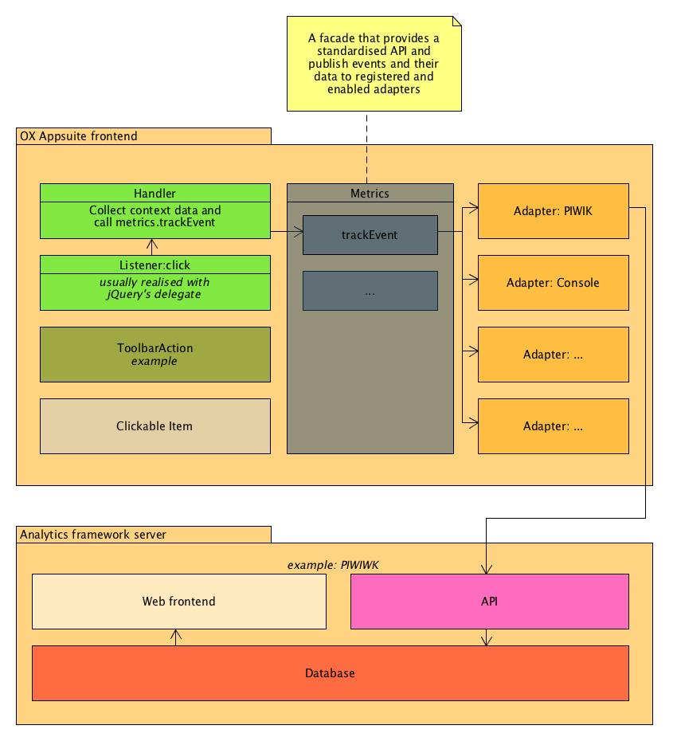

# Listeners

With metrics in mind listeners are waiting for special events to occur - usually a user action that manifests as a mouse click.

Common practice is to register listeners by using [http://api.jquery.com/delegate/](<jQuerie’s delagat>) function. For example this snippet would listen for any mousedown event on an action icon within the mail app toolbar.

```javascript
  $('.classic-toolbar-container').delegate('.io-ox-action-link', 'mousedown', yourHandler);
```

**hint**: please do not register these listeners when metrics is disabled to avoid unnecessary work for the client. Simply use the isEnabled function provided (see below).

# Handlers

The Handler calls the public functions of the metrics module. To gain access to the metrics object simply require ‘io.ox/metrics/main’.

```javascript
  require(['io.ox/metrics/main'], function(metrics) {
    metrics.trackEvent({
        app: 'mail',
        target: 'detail/toolbar',
        type: 'click',
        action: $(e.currentTarget).attr('data-action')
    });
});
```

# Metrics module

The metrics module provide some simple API that enables you to track events.

## trackEvent()

\###app

- application name
- _example: ‘mail’_

\###target

- container/area
- _example: ‘detail/toolbar’_

\###type

- type of event
- _example: ‘click’_

\###action

- name/id of the action
- _example: ‘delete’_

## trackPage()

\###name

- name of the page. for OX Appsuite this is the name of the application
- _example: ‘mail’_

\###id

- id of the page.
- _example: ‘io.ox/mail’_

\###name

- name of the page
- _example: ‘Mail’_

## trackVariable()

- currently unused

## watch(options, data)

Shortcut to register a trackEvent listener by using \_.delegate on a container node

```javascript
  watch({
      node: $('#my-actions'),
      selector: '#my-button',
      event: 'click'
  }, dataToTrack)
```

## getUserHash()

return unique user (based on cookie value)

## isEnabled()

returns boolean that indicates status of the metrics module

```javascript
  require(['io.ox/metrics/main'], function (metrics) {
    var name = app.get('parent').get('name') || 'unknown',
        apptitle = _.last(name.split('/')),
        facet = model.get('facet').get('id').split(':')[0];
    // toolbar actions
    metrics.trackEvent({
        app: apptitle,
        target: apptitle + '/search/facet/' + facet,
        action: 'search',
        value: facet
    });
  });
```

# Adapters

Please visit the [Adapters Page](TODO).
