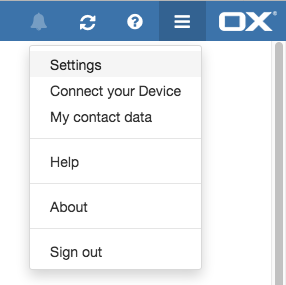
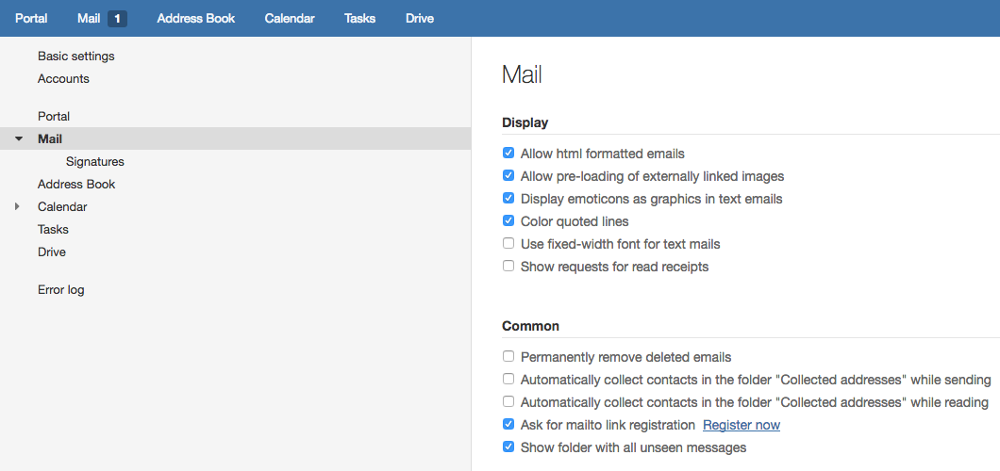
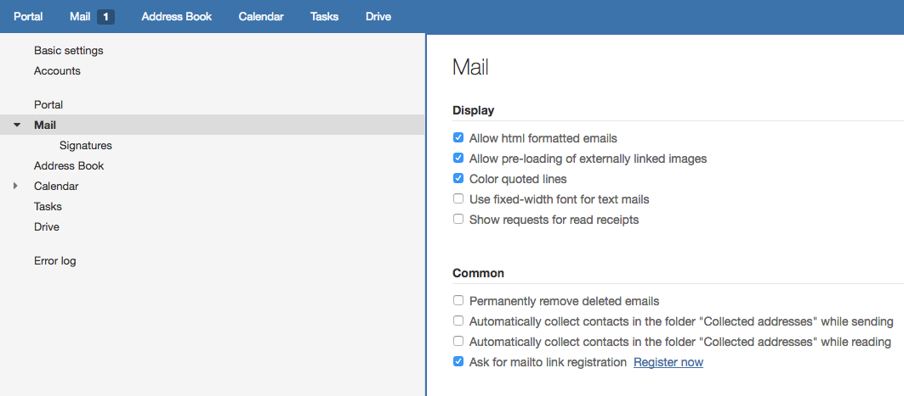

The UI can provide an unread messages folder, if the IMAP server has a folder which contains all unseen messages. Alternatively, a folder with all messages is sufficient, but will have a large performance impact on the IMAP-server.

# Configuration

The following Dovecot and OX App Suite configuration is required:

## Dovecot configuration

The Dovecot server needs to provide a virtual folder, which contains all unread but not deleted messages without spam or trash. Additional information about virtual folders can be found in the [Dovecot documentation about virtual folders](https://doc.dovecot.org/configuration_manual/virtual_plugin/).

The following needs to be added to the dovecot configuration:

```
mail_plugins = $mail_plugins virtual

namespace {
   prefix = virtual/
   separator = /
   location = virtual:/etc/dovecot/virtual:INDEX=~/virtual
   list = no
}
```

Additionally, the virtual folder configuration has to be added in the `/etc/dovecot/virtual/unseen/dovecot-virtual` file:

```
INBOX
  unseen not deleted
INBOX/*
-INBOX/Trash
-INBOX/Trash/*
-INBOX/Spam
-INBOX/Spam/*
  unseen not deleted
```

Alternatively, if you do not have the `INBOX` prefix:

```
*
-Trash
-Trash/*
-Spam
-Spam/*
-virtual/*
  unseen not deleted
```

## OX App Suite Configuration

The App Suite UI needs to know, where to look for unread messages. Therefore, you have to add the folder configuration and enable the unread folder with the following

```
io.ox/mail//allUnseenMessagesFolder=default0/virtual/unseen
io.ox/mail//features/unseenFolder=true
```

in to the `/opt/open-xchange/etc/settings/appsuite.properties`-file.

Finally, the configuration needs to be applied by calling `/opt/open-xchange/sbin/reloadconfiguration`.

## Alternative

If you have a Dovecot virtual folder which contains all messages ([see configuration]({{ site.baseurl }}/ui/features/all-messages-folder.html)), the UI will be able to simulate a unread folder. But this will produce a lot of load on the Dovecot, as the filtering for unread and deleted messages and messages in trash or spam folders is done manually.

If the all folder is configured correctly, you just have to enable the unread folder feature as follows

```
io.ox/mail//features/unseenFolder=true
```

in the `/opt/open-xchange/etc/settings/appsuite.properties`-file and reload the configuration `/opt/open-xchange/sbin/reloadconfiguration`.

## Additional UI settings

If the feature is enabled, this folder will be shown to every user. If a user does not want to see the unseen messages folder, the user can change the setting in the mail settings view:




<br />

Also the admin can set the default visibility of the feature to false. Therefore first open the file `/opt/open-xchange/etc/settings/appsuite.properties`. There the admin has to add `io.ox/mail/unseenMessagesFolder`and set it to `false`:

```
io.ox/mail//unseenMessagesFolder=false
```
Make sure, that that field is not protected such that the user is able to change that setting. Otherwise, if the admin wants that the folder is always shown, set the above setting to true and leave it protected.

After this, the mail configuration file must be reloaded so that the changes made take effect:

```
/opt/open-xchange/sbin/reloadconfiguration
```
So for example the "Show folder with all unseen messages" select field is not displayed in the settings under Common despite the fact that the feature is enabled:


