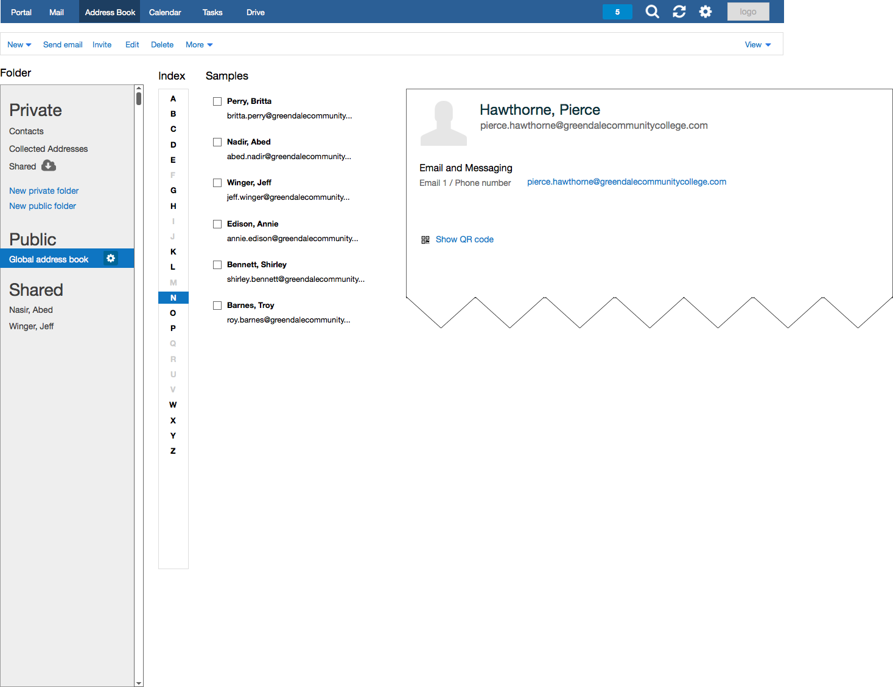
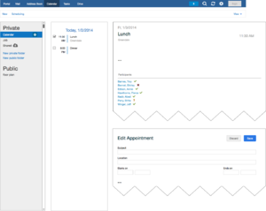
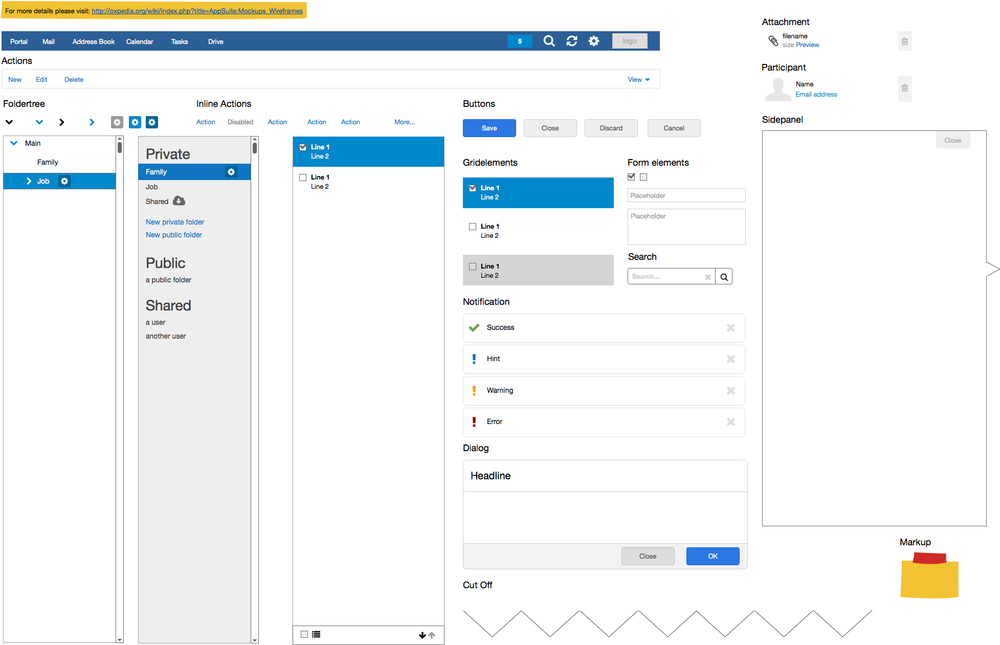

# Why build mockups?

Here are some reasons, why YOU should think about using the power of mockups:

- It reproduces the experience of sketching on a whiteboard, but using a computer.
- It dramatically helps to visually any kind of ideas, features of a web application. Mockups are very useful, for example in contracts, proposals, user stories or software change request forms.
- Enhance the visibility of your upcoming features inside a product / customization.
- Iterate easily over ideas + get feedback from potential users and customers until they are ready to get implemented via the development department.

This page contains needed informations, to easily build wireframes/mockups for the Open-Xchange App Suite application.


IMPORTANT NOTE: To build/use the mockups, which get described in this article, you need to install a 3rd party software (Balsamiq) on your local PC/Laptop. 
Balsamiq can be used in a trial period. 
Once you decide to constantly use it, you must purchase a license from their [website](http://balsamiq.com/products/mockups/).

# What´s needed to build beautiful App Suite mockups ?

Following Steps are required, to get started to build nice mockups for App Suite.

- You need to install the desktop application called "Balsamiq Desktop App". You can download it from: [http://balsamiq.com](http://balsamiq.com)
- Download the Open-Xchange Balsamiq Assets/Library/Samples from [ox-assets-balsamiq-7.6.2.zip](http://oxpedia.org/wiki/index.php?title=File:Ox-assets-balsamiq-7.6.2.zip)
- Import the downloaded App Suite assets/library into the Balsamiq application and use the included examples:

## On MAC OS X / Linux / Windows

1. Checkout from GIT or download ZIP file.
2. Unzip & navigate to the created directory "assets" . Remember/Copy complete local path to this directory. Example: "/Users/<myuser>/Downloads/ox-assets-balsamiq/assets"
O3. pen Balsamiq Application and > open menu "Balsamiq Mockups" > Click "About Balsamiq Application"
4. "About Dialog" opens with a link to "Open Local Store Folder". Click on that link, which opens your explorer/finder application.
5. Now create the required file called "BalsamiqMockups.cfg" inside that directory ("Local Store" folder) with following content. IMPORTANT You must change the assets path attribute to YOUR path structure on YOUR local system.

```xml
 <config>
   <fontFace>Helvetica Neue</fontFace>
   <rememberWindowSize>true</rememberWindowSize>
   <useCookies>true</useCookies>
   <assetsPath>/Users/<myuser>/Downloads/ox-assets-balsamiq/assets</assetsPath>
 </config>
```

1. Now use your explorer/finder/shell and copy all ".bmml" files from within the "visuals/assets" directory to your work/dev directory.
2. Close the Balsamiq application and reopen it. You now should see a new tab called "Account Assets" in the UI components library. All OX related components are prefixed with "ox-" for easy find as you type usage.
3. Go to your work/dev directory which contains the copied ".bmml" files. Click on one of the .bmml files. You are DONE!
Let the fun begin! Mockup as your like and save the newly created file to your work/dev directory!

_Video Tutorial_

[https://www.youtube.com/watch?v=RstDlq9X-jA](https://www.youtube.com/watch?v=RstDlq9X-jA)

__General basics of Balsamiq__

- Working with Symbols - http://support.balsamiq.com/customer/portal/articles/110439
- How to Use an Existing File as a Symbol in Mockups - http://support.balsamiq.com/customer/portal/articles/110439
- Working with Text - http://support.balsamiq.com/customer/portal/articles/110121
- Tutorials - http://support.balsamiq.com/customer/portal/topics/49503-tutorials/articles

__Common pitfalls when using Balsamiq__

- Any files stored in an subdirectory of your assets folder don't show up in the 'account assets' tab within Balsamic cause currently subdirectories are ignored.
- In case your assets folder only contains images the 'account assets' will not show up
