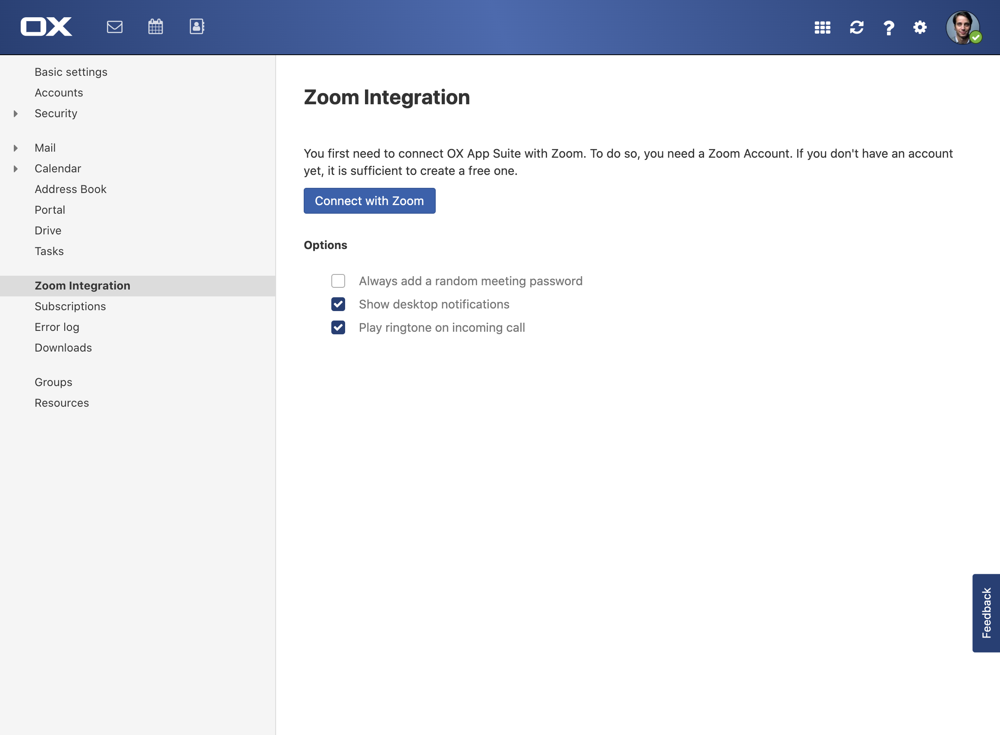
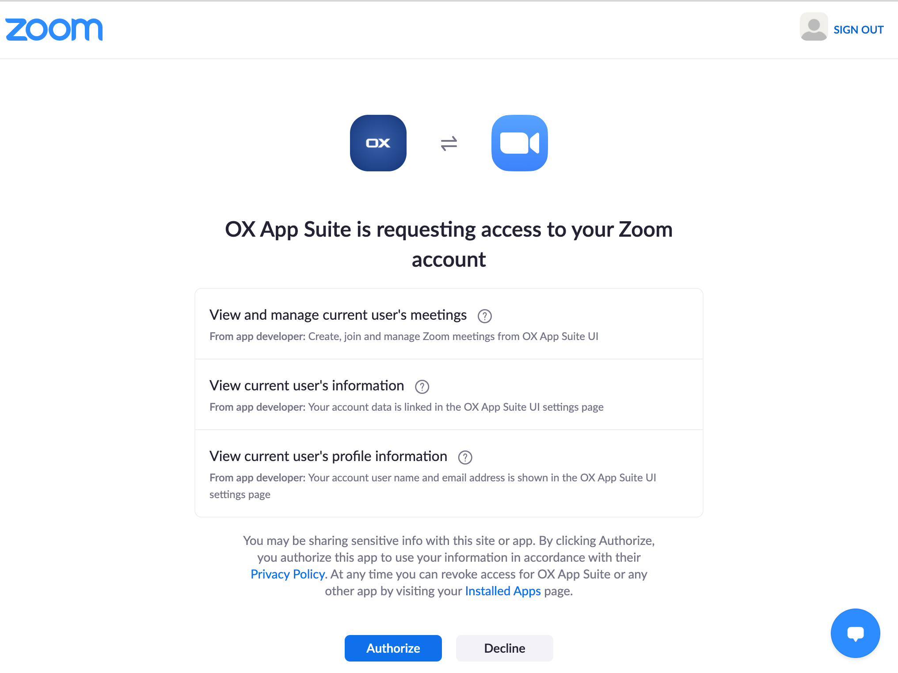
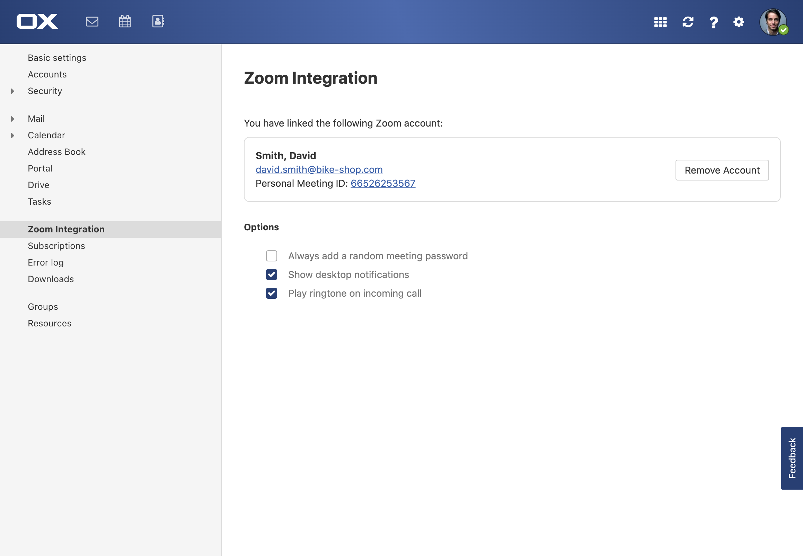
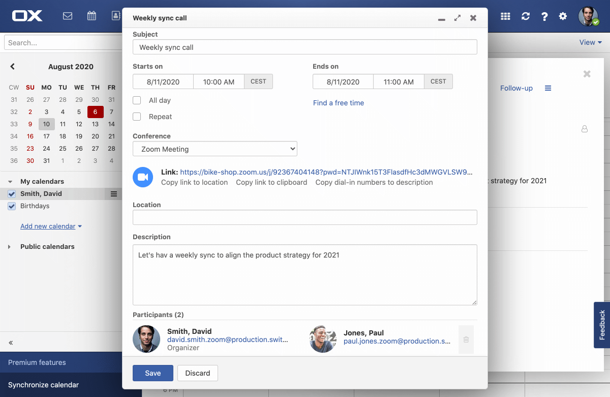
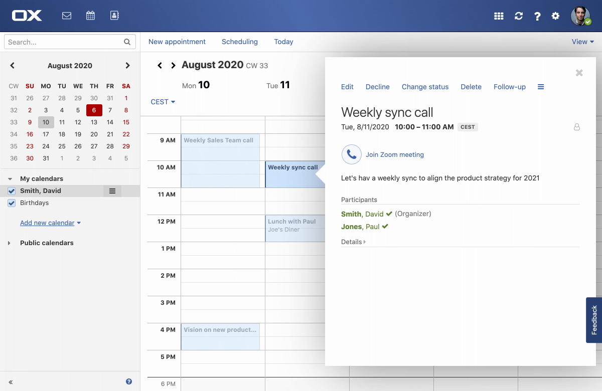
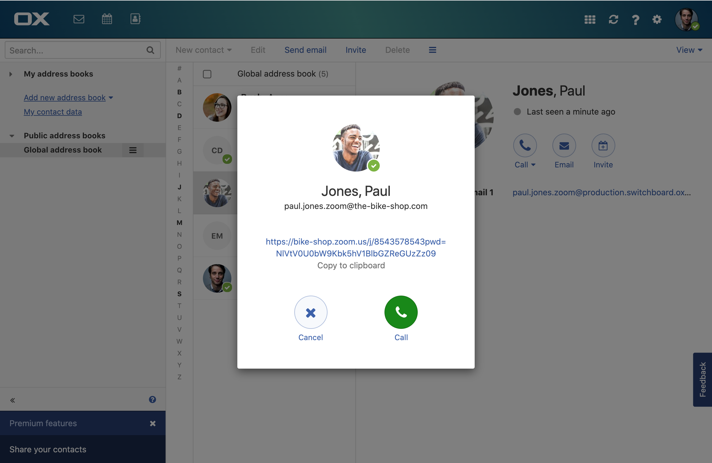
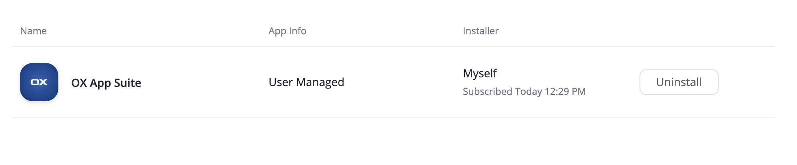

# Installation
1. You will need a valid Zoom Account which can be connected with OX App Suite.
2. To connect your account with OX App Suite go to Settings -> Zoom Integration
3. Press the button "Connect with Zoom". 
4. A new browser window will open, you may need to login into your Zoom Account
5. Press authorize to connect the OX App Suite with your Zoom account 
6. Your are done, you can now use Zoom directly from  App Suite UI! 

# Usage

The Zoom integration will make it super easy for you to schedule, join and manage your Zoom meetings in App Suite UI.

## Schedule a Zoom meeting
When scheduling new appointments, just select "Zoom" from the "Conference" dropdown. App Suite will instantly schedule a Zoom meeting for your appointment.

## Join a conference
To join a meeting which was already scheduled for an upcoming appointment, just click the "Join Zoom meeting" button from the appointment's detail view.

## Create an instant meeting
To quickly jump into an ad-hoc meeting, locate the "Call" button for a perosn in yout Addressbook App. App Suite will create an ad-hoc meeting for you instantly which both particpants can easily join. Just click on the meeting's link or hit the call button.

# Uninstallation

Removing your Zoom Account from OX App Suite is easy and can be done with one click
1. Go to Settings -> Zoom Integration
2. Click on "Remove Account" next to your Zoom Account name. This will remove the OX App Suite Zoom integration for your account 

Alternativley you can remove the Zoom integration by logging into your Zoom Account on [https://marketplace.zoom.us](https://marketplace.zoom.us)
1. Click on "Manage" in the topbar
2. Click on "Installed Apps" on the left
3. Select "OX App Suite" from the list and press "Uninstall" 
# Troubleshooting
If you have trouble using the Zoom or App Suite in general, please refer to the online Help.
1. Locate the question mark the topbar
2. Click to open the online help

For further assistance you can take a look at the [knowledge base](https://confluence-public.open-xchange.com/display/SKB)

